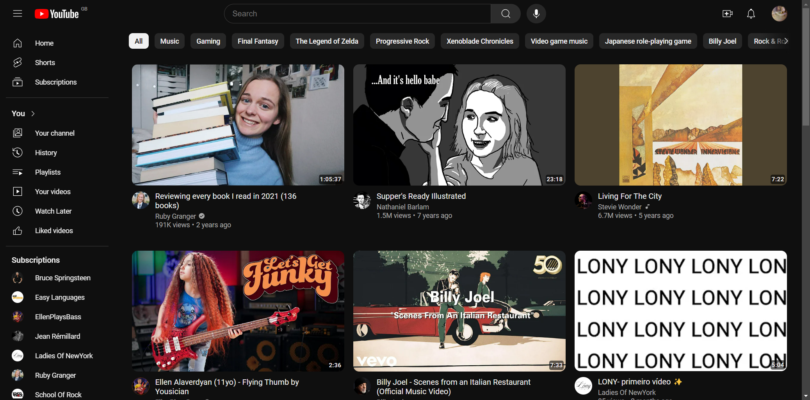

[REACT__BADGE]: https://img.shields.io/badge/-ReactJs-000000?logo=react&logoColor=61DAFB&style=for-the-badge
[JAVASCRIPT__BADGE]: https://img.shields.io/badge/javascript-000000?style=for-the-badge&logo=javascript
[SASS__BADGE]: https://img.shields.io/badge/sass-000000?style=for-the-badge&logo=sass
[PROJECT__BADGE]: https://img.shields.io/badge/📱Visit_this_project-000?style=for-the-badge&logo=project
[PROJECT__URL]: https://youtube-clone-seven-gules.vercel.app/

# Youtube - Clone 💻

![next][REACT__BADGE]
![javascript][JAVASCRIPT__BADGE]
![sass][SASS__BADGE]

[](/LICENSE)  

[](./public/ProjectImage.png)

## 📌 About

A project of my own (Matheus Junior), which in this case is a clone of the Youtube website.

This project was build in `React.js` using `npx create-react-app` command.

[![project][PROJECT__BADGE]][PROJECT__URL]

## 🤔 How to run the project in your device?

```bash
# Clone this repository
$ git clone https://github.com/MatheusJunior2334/youtube-clone.git

# Navigate to the project directory
$ cd youtube-clone

# Install the dependencies
$ npm install

# Run the project
$ npm start
```

Open [http://localhost:3000](http://localhost:3000) in your browser to see the result.

## ✍ Credits

This project uses images and icons taken from the Youtube website itself.

## 🎨 Creator

<table>
  <tr>
    <td align="center">
      <a href="https://www.linkedin.com/in/matheus-júnior">
        <br>
        <sub>
          <b>Matheus Júnior</b>
          <br />
          <a href="#" title="Code">💻</a>
        </sub>
      </a>
    </td>
  </tr>
</table>

## 📝 License

This project is licensed under the [MIT](/LICENSE) Licence.